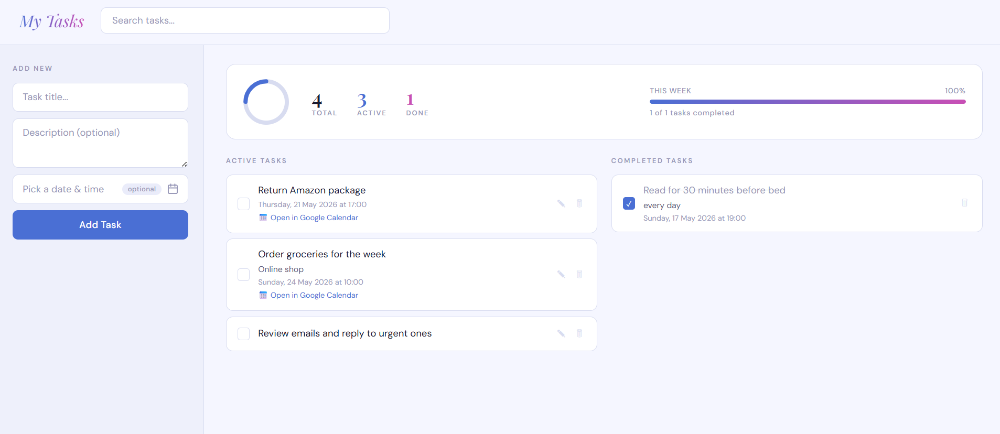

# My Tasks

A personal task manager with a web UI, REST API, and CLI — built with Flask and vanilla JS.

## Screenshot



## Features

- **Add, edit, and delete tasks** with an optional description and due date
- **Google Calendar integration** — tasks with a due date create a Calendar event automatically
- **Drag-and-drop reordering** — rearrange active tasks by dragging
- **Completion animation** — confetti burst when you tick a task done
- **Analytics** — live donut chart and weekly progress bar
- **Search** — filter tasks instantly from the top bar
- **Responsive** — works on mobile and desktop

## Running the app

### 1. Install dependencies

```
pip install -r requirements.txt
```

### 2. Set up Google OAuth

1. Go to [Google Cloud Console](https://console.cloud.google.com/) → APIs & Services → Credentials
2. Create an OAuth 2.0 Client ID (Desktop app type)
3. Download and save as `credentials.json` in the project root
4. Enable the **Google Calendar API** for your project

### 3. Start the backend

```
python app.py
```

Runs on `http://localhost:5000`. On first run a browser window will open for Google OAuth — this is expected. The token is saved to `token.json` and refreshed automatically.

### 4. Open the frontend

Open `index.html` directly in your browser.

## Project structure

| File | Role |
|---|---|
| `app.py` | Flask REST API |
| `index.html` | Single-page web frontend |
| `tasks.json` | JSON persistence |
| `credentials.json` | Google OAuth credentials (not committed) |
| `token.json` | Auto-generated OAuth token (not committed) |

## API

| Method | Route | Description |
|---|---|---|
| GET | `/tasks` | List all tasks |
| POST | `/tasks` | Create a task |
| PUT | `/tasks/<index>` | Update a task |
| PATCH | `/tasks/<index>` | Toggle done/undone |
| PUT | `/tasks/reorder` | Persist drag-and-drop order |
| DELETE | `/tasks/<index>` | Delete a task |
